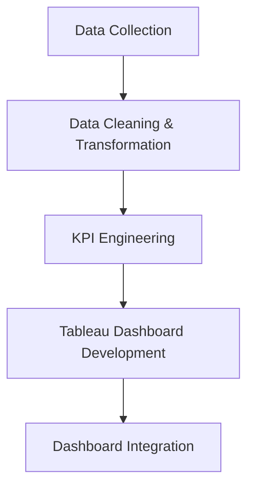
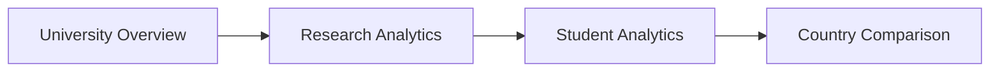
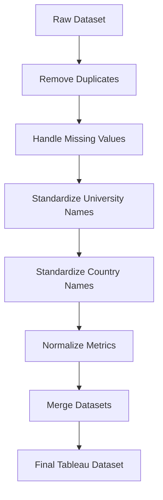

# 🎓 EduVision DV — Higher Education Performance Dashboard

An interactive **Tableau dashboard suite** for analyzing global university rankings, research performance, student diversity, academic reputation, and country-level higher education trends.

---

## 📌 Project Overview

**EduVision DV** is a comprehensive Higher Education Performance Dashboard that transforms raw global university data into meaningful, interactive, and decision-ready insights.

The project integrates publicly available higher education datasets — including university ranking and performance indicators — and processes them using **Python, Pandas, and NumPy** before visualizing the results in **Tableau**.

The final solution consists of **four interconnected interactive dashboards**:

| # | Dashboard | Focus |
|---|-----------|-------|
| 1 | 🏛️ University Overview | Institution-level ranking performance |
| 2 | 🔬 Research Analytics | Research impact & productivity |
| 3 | 🎓 Student Analytics | Student population & diversity |
| 4 | 🌍 Country Comparison | Country-level education benchmarking |

The suite lets users compare universities and countries on ranking performance, research impact, academic reputation, student population, internationalization, and other educational indicators.

---

## 🔄 Project Workflow



### Step 1 — Data Collection
University ranking and performance datasets are collected from publicly available sources, covering:
- University rankings
- Academic reputation
- Research performance
- Student population & international students
- Faculty-to-student ratio
- Country / regional information

### Step 2 — Data Cleaning & Transformation
Python is used to prepare the raw data for analysis:
- Remove duplicate records
- Handle missing values
- Standardize university and country names
- Normalize numerical indicators
- Convert inconsistent data formats
- Merge related datasets into a Tableau-ready dataset

**Target:** dataset completeness above 95%, with less than 2% missing values after cleaning.

### Step 3 — KPI Engineering
Six education performance KPIs are generated (see [KPI table](#-key-performance-indicators) below) to convert raw indicators into comparable performance measures.

### Step 4 — Tableau Dashboard Development
The processed dataset is imported into Tableau, where dashboards are built using charts, KPI cards, maps, treemaps, scatter plots, bar charts, filters, parameters, and dashboard actions.

### Step 5 — Dashboard Integration
The four dashboards are integrated into a single Tableau workbook with global filters and cross-dashboard navigation:



---

## 📊 Dashboards

### 1. 🏛️ University Overview
Executive-level summary of global university performance.

- **KPIs:** Global Ranking Score · Research Impact Score · Academic Reputation Score · International Student Percentage
- **Visuals:** Top universities by Global Ranking Score, Top 10 by QS/THE rankings, academic reputation analysis, institutional comparison, global university distribution
- **Purpose:** Quickly see which universities perform best, how they compare across ranking systems, and how reputation and performance vary by region.

### 2. 🔬 Research Analytics
Focuses on university research performance.

- **KPIs:** Research Impact Score · Research Productivity Index · Research Quality · Industry Impact
- **Visuals:** Research impact comparison, top institutions by impact/productivity/quality, research environment analysis, research quality trend
- **Purpose:** Identify high-impact research institutions and understand the relationship between research productivity, quality, and environment.

### 3. 🎓 Student Analytics
Focuses on student population and diversity.

- **KPIs:** International Student Percentage · Total Students · Female Students Percentage · Student-to-Staff Ratio
- **Visuals:** International student analysis, faculty-to-student ratio analysis, enrollment comparison, student distribution and diversity trends
- **Purpose:** Analyze student population, international participation, gender distribution, and faculty-to-student ratios.

### 4. 🌍 Country Comparison
Country-level benchmarking of higher education performance.

- **Metrics:** Global Ranking Score · Academic Reputation · International Student Percentage · University Count · Research Impact Score · Faculty-to-Student Ratio
- **Visuals:** Country comparisons by ranking and reputation, international student participation, university count by country, research impact benchmarking, global university distribution
- **Purpose:** Compare countries, identify high-performing education systems, and benchmark performance at a national level.

---

## 📈 Key Performance Indicators

| KPI | Description |
|---|---|
| **Global Ranking Score** | Overall ranking/performance score of a university or country. |
| **Research Impact Score** | Measures the influence and impact of university research. |
| **Faculty-to-Student Ratio** | Teaching capacity, comparing faculty numbers to student population. |
| **International Student Percentage** | Proportion of international students within the student population. |
| **Academic Reputation Score** | Academic reputation based on available ranking indicators. |
| **Research Productivity Index** | Research output/productivity using available research indicators. |

---

## 🧹 Data Cleaning



**Data quality goals**
- Dataset completeness: 95%+
- Missing values: < 2%
- Consistent university and country naming
- Valid numerical indicators
- Tableau-compatible dataset

---

## 🛠️ Technology Stack

| Area | Technology |
|---|---|
| Data Collection | Python |
| Data Processing | Pandas, NumPy |
| Data Cleaning | Python, Jupyter Notebook |
| KPI Engineering | Python |
| Data Storage | CSV, Excel |
| Visualization | Tableau Desktop |
| Dashboard Integration | Tableau Filters, Parameters, Actions |
| Documentation | Markdown, GitHub |

## 📁 Project Structure

```
EduVision-DV/
│
├── README.md
│
├── milestone-1-data-collection-preparation/
│   ├── module-1-university-data-collection/
│   │   ├── university_raw_data.csv
│   │   └── data_collection.py
│   │
│   └── module-2-data-cleaning-transformation/
│       ├── university_cleaned.csv
│       └── education_cleaning.ipynb
│
├── milestone-2-kpi-engineering-dashboard-planning/
│   ├── module-3-education-kpi-engineering/
│   │   ├── university_final_dataset.xlsx
│   │   └── generate_education_kpis.py
│   │
│   └── module-4-dashboard-planning-prototyping/
│       ├── dashboard_storyboard.pdf
│       └── eduvision_prototype.twbx
│
├── milestone-3-dashboard-development/
│   ├── module-5-university-overview-research-analytics/
│   │   └── eduvision_dashboard_v1.twbx
│   │
│   └── module-6-student-analytics-country-comparison/
│       └── EduVision_DV.twbx
│
├── milestone-4-testing-delivery/
│   ├── module-7-testing-validation/
│   │   ├── qa_checklist.pdf
│   │   └── dashboard_testing_report.pdf
│   │
│   └── module-8-documentation-project-delivery/
│       └── project_documentation.pdf
│
└── dashboard/
    └── EduVision_DV.twbx        # final integrated workbook
```

---

## 🎛️ Interactive Features

- **Filters** — by university, country, QS region, and other dimensions
- **Dashboard Navigation** — move between all four dashboards
- **Comparative Analysis** — compare universities, countries, ranking scores, research performance, student populations, and reputation
- **Drill-Down Exploration** — go from high-level KPIs to detailed information

---

## 👥 Target Users

| User | Use Case |
|---|---|
| 🎓 **Students** | Compare universities, understand rankings, explore international student presence |
| 👨‍🏫 **Academic Researchers** | Study research performance and impact, compare institutions |
| 🏛️ **University Administrators** | Benchmark performance, identify strengths/weaknesses, compare productivity |
| 🏛️ **Policymakers** | Compare education systems, analyze country-level trends, support policy decisions |
| 📊 **Education Consultants** | Compare institutions, analyze global trends, support university selection |

---

## 📊 Expected Project Outcomes

- A unified higher education analytics solution
- Cleaned and standardized educational datasets
- Six engineered education KPIs
- Four interactive Tableau dashboards integrated into one workbook
- University-, research-, student-, and country-level performance analysis
- Global university distribution analysis
- Interactive filtering and dashboard navigation

---

## 🧪 Testing & Validation

| Category | Checks |
|---|---|
| **Data Validation** | Duplicate records, missing values, university/country name verification, numerical field validation |
| **KPI Validation** | KPI calculation accuracy, comparison against source indicators, aggregation behavior |
| **Dashboard Testing** | Filters, navigation, interactive actions, visualizations, labels/values, responsiveness |

**Target quality:**
- KPI Accuracy: > 95%
- Dataset Completeness: > 95%
- Major Dashboard Issues: 0

---

## 📅 Project Milestones

| Milestone | Modules | Deliverables |
|---|---|---|
| **1. Data Collection & Preparation** | University data collection, data cleaning & transformation | `university_raw_data.csv`, `data_collection.py`, `university_cleaned.csv`, `education_cleaning.ipynb` |
| **2. KPI Engineering & Dashboard Planning** | Education KPI engineering, dashboard planning & prototyping | `university_final_dataset.xlsx`, `generate_education_kpis.py`, dashboard storyboard, Tableau prototype |
| **3. Dashboard Development** | University Overview, Research Analytics, Student Analytics, Country Comparison, dashboard integration | `EduVision_DV.twbx` |
| **4. Testing & Delivery** | Testing & validation, documentation & project delivery | QA checklist, dashboard testing report, project documentation, GitHub repository, Tableau workbook |

---

## ▶️ How to Use the Project

**1. Clone the repository**
```bash
git clone https://github.com/springboardmentor873-a11y/https-github.com-springboardmentorpl-Higher-Education-Performance-Dashboard-Group-2/tree/Aishwarya-Mahadev-Todkari
```

**2. Install Python dependencies**
```bash
pip install pandas numpy jupyter
```

**3. Prepare the dataset**
Place the raw university dataset inside the `data/` folder.

**4. Run data processing**
```bash
python scripts/data_collection.py
```
Then perform cleaning and transformation using `notebooks/education_cleaning.ipynb`.

**5. Generate KPIs**
```bash
python scripts/generate_education_kpis.py
```

**6. Open the Tableau workbook**
Open `dashboard/EduVision_DV.twbx` using Tableau Desktop.

---

## 📦 Final Deliverable

The primary project deliverable is **`EduVision_DV.twbx`** — a single workbook containing four interconnected dashboards (University Overview → Research Analytics → Student Analytics → Country Comparison).

---

## 🏆 Project Highlights

📊 4 Interactive Tableau Dashboards · 📈 6 Education Performance KPIs · 🌍 Global University Analysis · 🏛️ University Ranking Comparison · 🔬 Research Performance Analytics · 🎓 Student Diversity Analytics · 🌎 Country-Level Benchmarking · 🧹 Python-Based Data Cleaning · 🔄 Integrated Tableau Workbook · 📋 Interactive Filters & Dashboard Actions

---

## 🎓 Skills Demonstrated

Data Analytics · Data Cleaning · Exploratory Data Analysis · Python · Pandas · NumPy · KPI Engineering · Tableau · Data Visualization · Dashboard Design · Interactive Analytics · Data Integration · Education Analytics · Data Storytelling

---

## 📄 Project Information

| Detail | Value |
|---|---|
| **Project Name** | EduVision DV |
| **Project Type** | Data Analytics & Visualization |
| **Domain** | Higher Education Analytics |
| **Primary Tool** | Tableau |
| **Programming Language** | Python |
| **Data Processing** | Pandas, NumPy |
| **Dashboards** | 4 |
| **KPIs** | 6 |
| **Final Output** | Tableau Workbook (`.twbx`) |
| **Repository** | GitHub |

---

## ⭐ Conclusion

EduVision DV demonstrates how data analytics and interactive visualization can transform complex higher education datasets into meaningful insights. By integrating university rankings, research indicators, student statistics, and country-level metrics, it provides a unified platform for understanding global higher education performance — moving from institution-level performance to research analytics, student analytics, and country-level benchmarking.

---

## 👩‍💻 Author

**Aishwarya Todkari**
Computer Engineering Student
Project: *EduVision DV — Higher Education Performance Dashboard*

---

🙏 Thank you for checking out this project!
